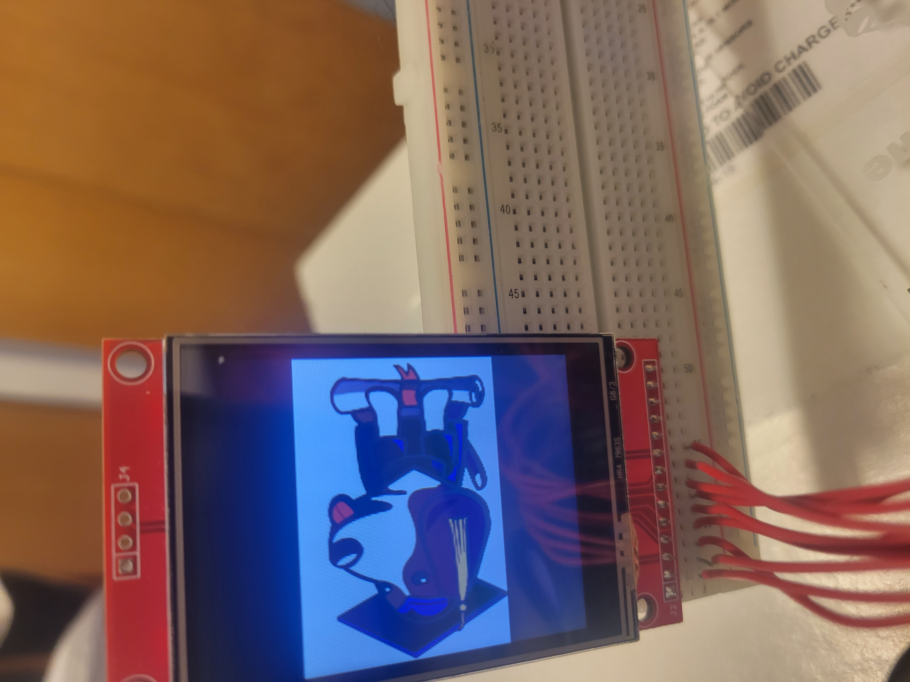
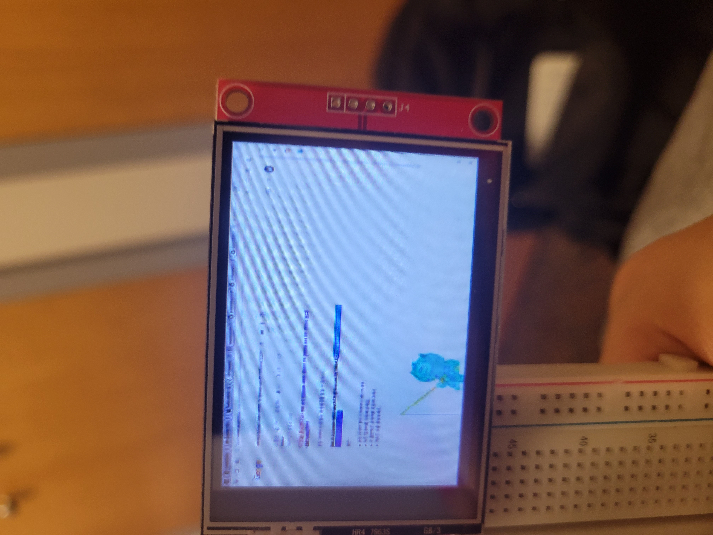
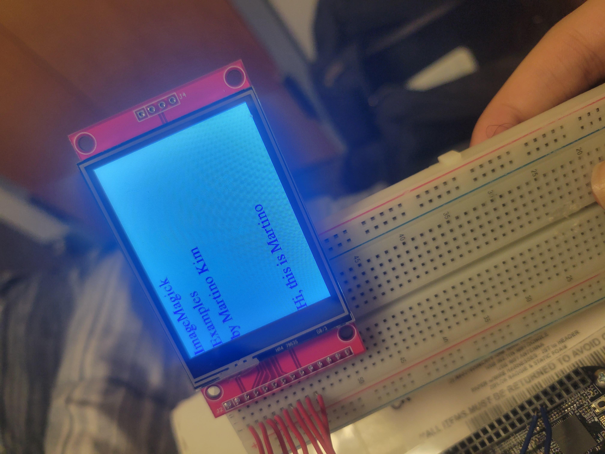

# HW04
### Martino Kim

---

## Memory Map

| Block Name | Start Address | End Address | Size | Description |
|------|---------------|-------------|------|-------------|
| EMIF0 SDRAM | 0x8000_0000 | 0xBFFF_FFFF | 1 GB | 8-/16-bit External Memory |
| GPIO0 | 0x44E0_7000 | 0x44E0_7FFF | 4KB | GPIO0 Registers |
| GPIO0 | 0x44E0_8000 | 0x44E0_8FFF | 4KB | Reserved |
| GPIO1 | 0x4804_C000 | 0x4804_CFFF | 4KB | GPIO1 Registers |
| GPIO1 | 0x4804_D000 | 0x4804_DFFF | 4KB | Reserved |
| GPIO2 | 0x481A_C000 | 0x481A_CFFF | 4KB | GPIO2 Registers |
| GPIO2 | 0x481A_D000 | 0x481A_DFFF | 4KB | Reserved |
| GPIO3 | 0x481A_E000 | 0x481A_EFFF | 4KB | GPIO3 Registers |
| GPIO3 | 0x481A_F000 | 0x481A_FFFF | 4KB | Reserved |

---

## GPIO via mmap

1. gpioMmap.py reads 2 switches and controls two LEDs(usr2 & usr3). The GPIO pin for switches are P9_11(gpio0[30]) & P9_14(gpio1[18]). To run the code, use 'sudo ./gpioMmap.py' command.

2. gpioMmapToggle.py toggles LED connected to P9_15(GPIO1[16]) as fast as I could. The period was 6.23us with sleep(0.000001) and 5.88us without sleep() command. There wasn't a dramatic change, but without sleep command was slightly faster. To run the code, use 'sudo ./gpioMmapToggle.py' command.

---

## i2c via the kernel driver

> i2ckernel.sh reads the TMP101 sensors using the kernel driver. Use command 'sudo i2ckernel.sh' to run.

---

## Control the LED matrix from a browser

> etch_a_sketch4.py controls the LED matrix from a web browser via Flask. The buttons are 'up', 'down', 'left', 'right', 'col+1', 'col-1', 'row+1', 'row-1', which are the 4 cursur control commands and 4 gamesize control commands.

> use command 'sudo etch_a_sketch4.py' to run the game.

---

## 2.4'' TFT LCD Display

### Display Images

> displays image of boris

### 

### Play Movie

> displays movie (I recorded a movie and changed the resolution to 320x240 and played it)

### Generate Text

> displays text I generated

