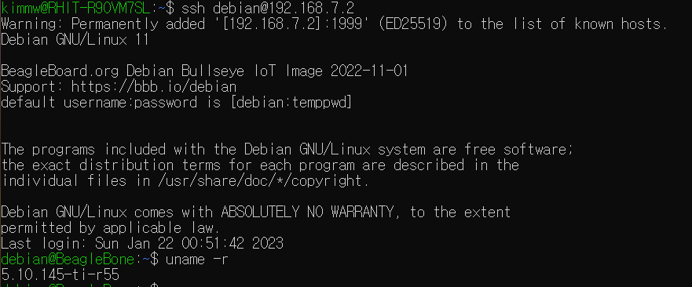
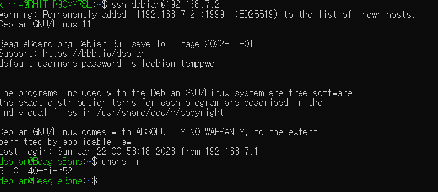

# HW05
### Martino Kim

---

## Project

> added a project for snake game

---

## Make

> Makefile at /hw05/make folder. Use 'make' command to run it.

---

## Installing the Kernel source

> Installed new kernel version 5.10.145-ti-r55.

> Original kernel version was 5.10.140-ti-r52.

---

## Kernel Modules

> Tested hello, ebbchar, gpio_test, LED

> modified gpio_test at ./gpio_test to copy P9_11 to P9_15. Had it trigger for both rising and falling edges.

> modified gpio_test at ./gpio_test2 to copy P9_11 to P9_15 & P9_12 to P9_18

---

## Kernel Modules LED

> Modified led example to flash two LED with ports P9_15 & P9_18 with period of 1000 & 2000.

---

## ADXL345 Accelerometer

> Added ADXL345 device parallel to the other TMP101 devices.

> in iio:device1, there are the sampling frequency, scale, sampling_frequency available, name, power, uevent, and the clibbias and raws for each axis(x,y,z).

> Edited etch-a-sketch to move the cursur by the measurement of accelerometer.
