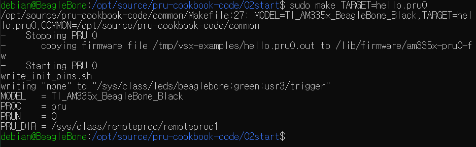
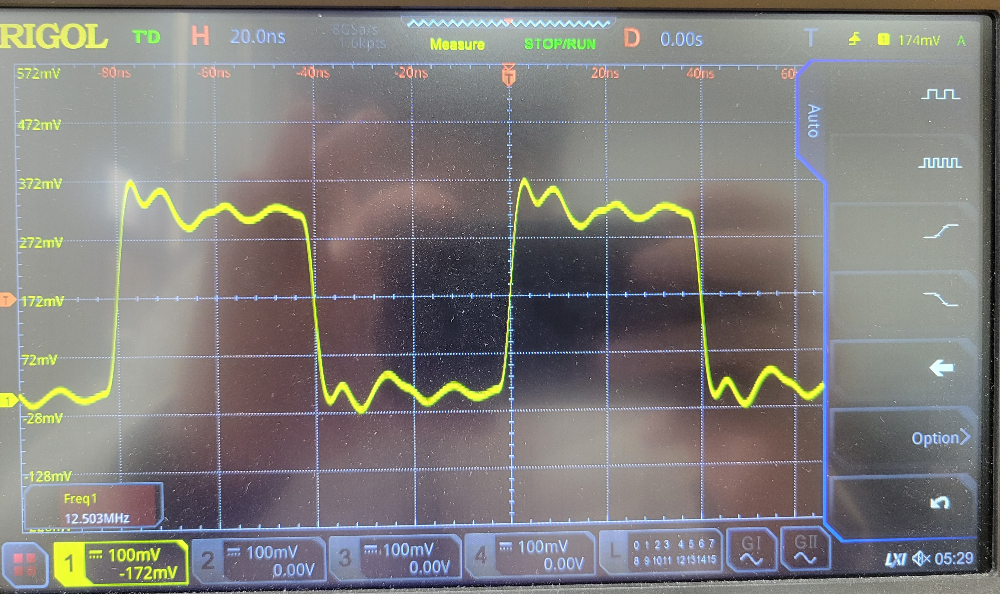
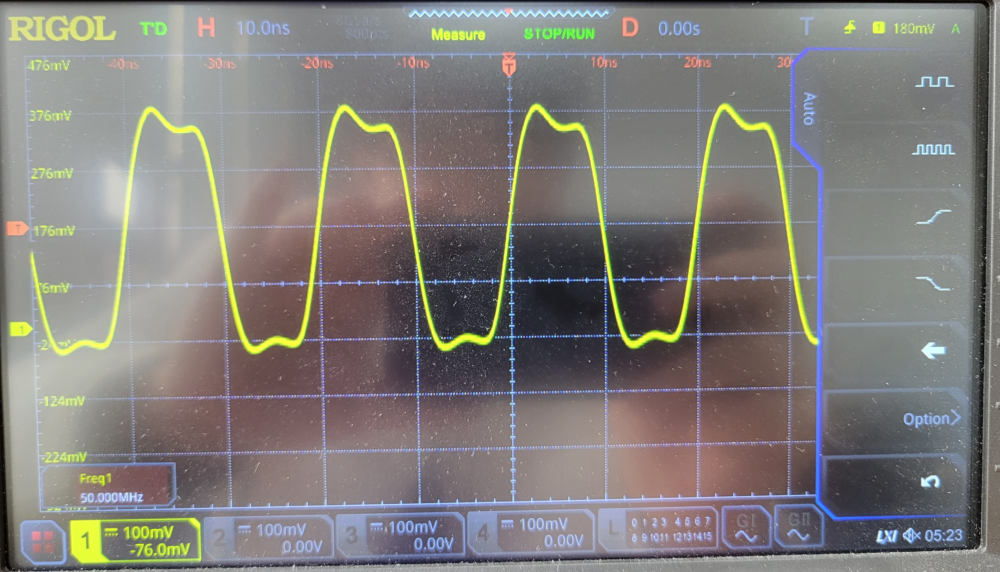

# HW08
### Martino Kim

---

## PRU

Copied files from /pru-cookbook-code/02start.

### 2.6 Blinking an LED

> To start PRU code running, use root login first, then use 'source setup.sh && make' command. 

> The start command blinks usr3 LED repeatedly then stops after 10 times of blinking. 

> After starting PRU, you can stop the code by 'echo stop > /sys/class/remoteproc/rem
oteproc1/state', and restart by 'echo start > /sys/class/remoteproc/rem
oteproc1/state

> modified hello.pru0.c to blink LED using port P9_31. Delay set to 0.

> The LED looks like continuously turned on when delay = 0.

> When delay = 0, the frequency is 12.5MHz.

### 5.3 PWM Generator

> captured 50MHz PWM signal by using pwm1.pru0.c. Before running the code, you should set P9_31 to pruout by 'config-pin P9_31 pruout', and then run the code by 'make TARGET=pwm1.pru0' (those files are on /opt/source/pru-cookbook-code/05blocks... too many files to put in this directory).

> delay with 1 between turning off the LED is inserted to have stable 50MHz PWM signal.

### 5.4 Controlling the PWM Frequency (Optional)

# hw08 grading

| Points      | Description |
| ----------- | ----------- |
| 14/14 | PRU
|  0/2 | Controlling the PWM Frequency - optional
|  0/2 | Reading an Input at Regular Intervals - optional
|  0/2 | Analog Wave Generator - optional
| 14 | **Total**

*My comments are in italics. --may*
