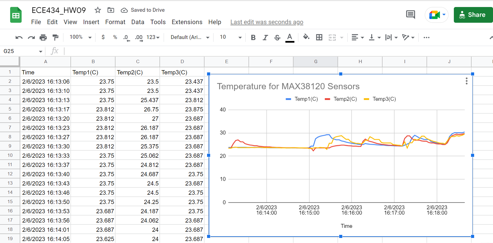

# HW09
### Martino Kim

---

## Project

## MAX31820 Temperature Sensors

> Wired three MAX31820s on port P9_14. First load /lib/firmware/BB-W1-P9.14-00A0.dtbo at /boot/uEnv.txt uboot overlay before running the code, then run by ./oneWire.py

## Logging in sheets

> Logged the temperature readings on google, by ./hw9.py command. The URL of the spreadsheet is https://docs.google.com/spreadsheets/d/1Qq1abWOPXPoykrmv8y4Qghy7lYY3xB-V6oDtFKgl6qg/edit?usp=sharing , anyone with the link can view it. There is a logged data of three temperature sensors and a chart for them.

